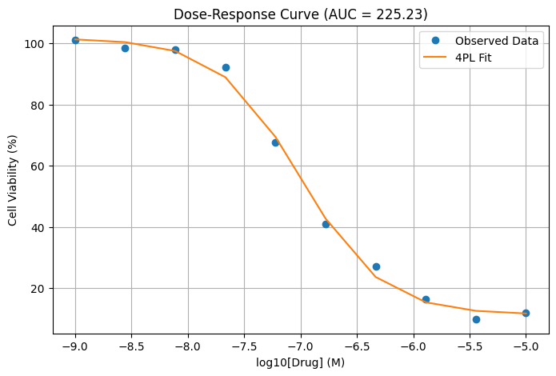

```python
import numpy as np
import pandas as pd
import matplotlib.pyplot as plt
from scipy.optimize import curve_fit
from scipy.integrate import simpson  # Simpson's rule for integration

# Simulated dose (log scale) and viability (%) data
log_doses = np.linspace(-9, -5, 10)  # from 10^-9 to 10^-5 M
true_params = {
    'Top': 100,        # max viability
    'Bottom': 10,      # min viability
    'IC50': 1e-7,      # 100 nM
    'HillSlope': 1.2   # curve steepness
}

# 4-parameter logistic function
def four_param_logistic(x, Bottom, Top, IC50, HillSlope):
    return Bottom + (Top - Bottom) / (1 + (10**x / IC50)**HillSlope)

# Generate synthetic data
np.random.seed(42)
viability = four_param_logistic(log_doses, **true_params)
noise = np.random.normal(0, 3, size=viability.shape)
viability_noisy = viability + noise

# Fit 4PL model to noisy data
popt, _ = curve_fit(four_param_logistic, log_doses, viability_noisy, 
                    bounds=([0, 50, 1e-10, 0.1], [100, 120, 1e-4, 5]))

# Predict fitted values and calculate AUC
fitted_vals = four_param_logistic(log_doses, *popt)
auc = simpson(fitted_vals, log_doses)  # numerical integration over log10(drug concentration)

# Plotting
plt.figure(figsize=(8, 5))
plt.plot(log_doses, viability_noisy, 'o', label='Observed Data')
plt.plot(log_doses, fitted_vals, '-', label='4PL Fit')
plt.xlabel('log10[Drug] (M)')
plt.ylabel('Cell Viability (%)')
plt.title(f'Dose-Response Curve (AUC = {auc:.2f})')
plt.legend()
plt.grid(True)
plt.show()

# Optional: view parameters and data
print("Fitted parameters (Bottom, Top, IC50, HillSlope):", popt)
df = pd.DataFrame({'log_dose': log_doses, 'viability': viability_noisy})
print(df)
```


    

    


    Fitted parameters (Bottom, Top, IC50, HillSlope): [1.13642354e+01 1.01639234e+02 9.82216832e-08 1.19095561e+00]
       log_dose   viability
    0 -9.000000  101.133267
    1 -8.555556   98.378194
    2 -8.111111   97.950934
    3 -7.666667   92.256470
    4 -7.222222   67.694750
    5 -6.777778   40.900379
    6 -6.333333   27.050258
    7 -5.888889   16.294436
    8 -5.444444    9.798590
    9 -5.000000   11.984556

